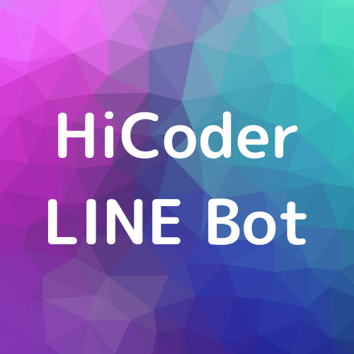

# HiCoder公式 LINE Botを作る
- 目的: チーム開発へのチャレンジ(失敗するかもしれない)

## 使用技術
- markdown
- git
- JavaScript(Node.js)
- heroku
- Messaging API (LINE Bot API)

## 段階
- WindowsにLinux環境を構築(WSL)
- markdownの書き方を学ぶ
- Gitの使い方を学ぶ
- GitHubの使い方を学ぶ(markdownで書いたものを使うなど、GitHubでのコミュニケーションに慣れる)
- npmなどのJavaScriptの環境構築
- LINE botについて調べる
- https://github.com/line/line-bot-sdk-nodejs を用いた開発(Pull Requestでやる)

## Time Schedule
- 全く読めないので考えてない。夏までに完成するといいなという感覚。

## 目標
- heroku+nodejsで作ったサーバから送ったリクエストでLINE Botにしゃべらせるところ。
- その後の目標は考えていない。作っていくうちに決めたい。